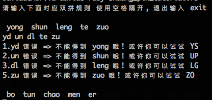
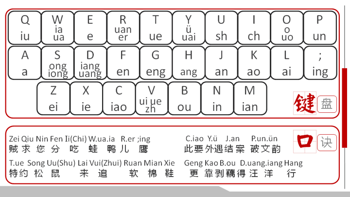

# 幫助你快速學習雙拼 -- 微軟雙拼（繁體中文版）

一個萌妹子風格的腳本文件，參考新華字典的設定，每次隨機出現出合理的拼音組合，\
根據輸出的拼音組合打出對應的雙拼，空格隔開，回車提交。



附上：
+ 雙拼鍵盤口訣
+ 速成200字



步驟：

- 如果沒有安裝ruby 的情況下，需要先[安裝ruby](https://ruby-china.org/wiki/install_ruby_guide)

- 在 `shuang_pin_tutorial.rb` 同級目錄下，執行下面命令即可
```bash
ruby shuang_pin_tutorial.rb
```
- 或者在 Mac/Linux 上執行
```bash
./shuang_pin_tutorial.rb
```
